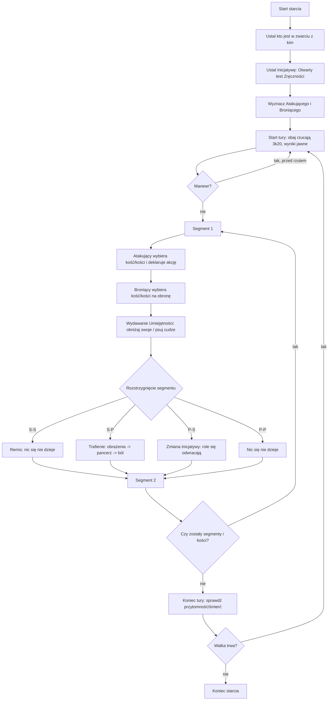
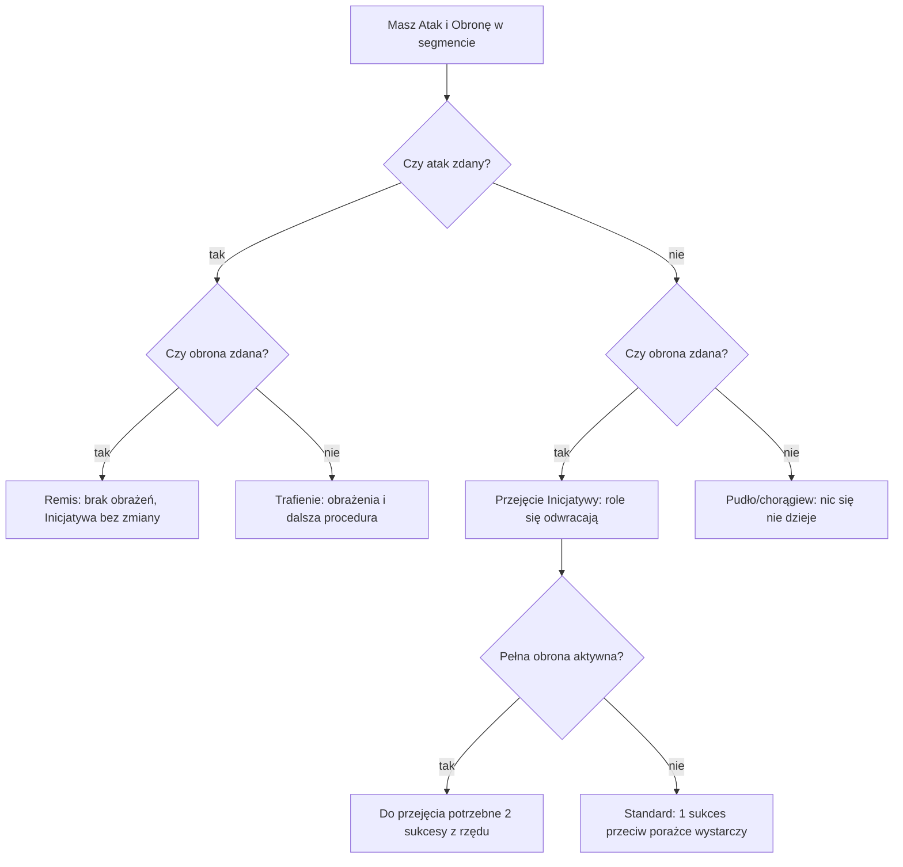

# Neuroshima 1.5: walka wręcz krok po kroku dla prowadzącego i do wdrożenia w VTT

## Podsumowanie wykonawcze

W walce wręcz w Neuroshimie 1.5 kluczowe są trzy rzeczy: Inicjatywa, trzy segmenty tury oraz to, że w zwarciu obie strony na początku każdej tury rzucają 3k20 i widzą swoje wyniki. citeturn3view0turn6view0 W każdym segmencie atakujący wybiera jedną z trzech kości, deklaruje akcję (najczęściej cios), a broniący musi wybrać kość na obronę (nie może oddać ciosu w tym segmencie). citeturn6view0 Wynik segmentu ma tylko cztery warianty: remis (sukces-sukces), trafienie (sukces-porażka), przejęcie Inicjatywy (porażka-sukces) i pudło (porażka-porażka). citeturn6view0

Największy “hak” tej mechaniki (ważny do prowadzenia i automatyzacji) to łączenie sukcesów: jeśli atakujący ma 2 lub 3 sukcesy, może złożyć je w jeden mocny cios 2s lub 3s, który zużywa odpowiednio 2 lub 3 segmenty, ale rozlicza się od razu w pierwszym segmencie i nie da się go “wyprzedzić”. citeturn6view0turn14view0 Drugi “hak” to punkty Umiejętności: w walce można rozdzielać punkty na obniżanie własnych kości w dowolnym segmencie tury, a w walce wręcz dodatkowo można nimi “psuć” kości przeciwnika (podnosić wyniki na jego kościach, zamieniając sukcesy w porażki). citeturn8view1turn14view0

Rozliczenie obrażeń zawsze idzie tym samym torem: ustal poziom obrażeń z broni dla 1s, 2s lub 3s, ustal lokację po surowym wyniku kości (nie po zmodyfikowanym Umiejętnością), zastosuj pancerz lokacyjny i Redukcję, potem test bólu i ewentualny test przytomności oraz konwersję ran 3:1. citeturn5view2turn5view1turn5view4turn5view0 W walce z wieloma przeciwnikami jedna postać może być atakowana maksymalnie przez 5 osób naraz; broniący ma kary do Zręczności równe liczbie przeciwników, ale dostaje nielimitowane “darmowe kości obrony” na dodatkowych atakujących (poza głównym pojedynkiem). citeturn13view0turn13view1

Uwaga praktyczna do VTT: podręcznik nie opisuje “timeoutów” ani automatycznych decyzji za gracza, więc do gry online warto przyjąć jasne zasady stołu: co się dzieje, gdy obrońca nie odpowie, jak działa cofnięcie błędnego rzutu i kiedy MG może podjąć decyzję zastępczą. Takie fallbacki są procedurą prowadzenia, nie regułą podręcznikową. citeturn6view0

## Pojęcia, które musisz rozumieć zanim zaczniesz klikać

**Tura i segmenty.** Walka taktyczna jest dzielona na tury, a każda tura ma trzy segmenty. citeturn1view1turn6view0 W typowej strzelaninie często testujesz akcję 1k20 w segmencie, ale walka wręcz ma własną obsługę 3k20. citeturn8view1turn6view0

**Sukces i porażka w zwarciu.** W walce wręcz każda pojedyncza kość jest testem Zręczności (bazowo “Przeciętnym”, czyli PT = 0), zdanym jeśli wynik jest mniejszy lub równy Zręczności po uwzględnieniu modyfikacji Umiejętności i innych bonusów/kar. citeturn6view0turn22view0

**Inicjatywa.** Walka “zaczyna się od ustalenia Inicjatywy” (cytat). citeturn3view0 Inicjatywa jest ustalana przed walką i nie jest liczona co turę; w teście Inicjatywy można użyć Umiejętności walki bronią, którą dobywasz do tej walki. citeturn3view0 W samej walce wręcz Inicjatywa przełącza role “Atakujący/Broniący” w środku tury, gdy obrońca uzyska sukces przeciw porażce atakującego. citeturn6view0

**PT, czyli Poziom Trudności.** W podręczniku jest tabela PT, która zamienia poziom trudności na modyfikator do Współczynnika (np. Problematyczny = -2, Trudny = -5, Bardzo trudny = -8). citeturn22view0 W walce wręcz bazowo test jest “Przeciętny” (PT = 0), ale manewr “Zwiększone tempo” potrafi sztucznie podnieść PT testów akcji w zwarciu nawet o 3 poziomy. citeturn14view0turn22view0

**Punkty Umiejętności w walce.** W trakcie jednej tury możesz obniżyć wyniki na dowolnych z trzech kości używanych w walce o łączną liczbę “oczek” równą wartości odpowiedniej Umiejętności, i możesz zdecydować o tym dopiero w trakcie tury. citeturn8view1 Jeśli w tej samej turze chcesz użyć dwóch Umiejętności, wartość każdej spada o połowę, a przy trzech o 1/3. citeturn8view1 Dodatkowo w walce wręcz możesz użyć punktów Umiejętności także do dodawania oczek do kości przeciwnika (psucie sukcesów). citeturn14view0

## Sekwencja od ustalenia Inicjatywy do zakończenia rundy

Poniżej masz “szynę” działań tak, żebyś mógł ją odpalić 1:1 przy stole lub w VTT.

**Krok A: Ustal, kto jest w zwarciu z kim.**  
W zwarciu traktuj to jako “pojedynek”: jedna osoba ma Inicjatywę (jest Atakującym), druga się broni (jest Broniącym). citeturn6view0 Jeśli jest więcej walczących, przejdź później do sekcji “Wielu przeciwników”, bo pairing ma własne kroki. citeturn13view0

**Krok B: Ustal Inicjatywę na start starcia.**  
1) Każda strona wykonuje Otwarty test Zręczności (to ważne: “Otwarty”, nie zwykły). citeturn3view0turn17view0  
2) “Otwarty” oznacza w skrócie: rzut bez PT, odrzucasz najgorszą z trzech kości (bo do zdania testu wystarczą 2 sukcesy), używasz Umiejętności do obniżenia pozostałych i liczysz “oczka w zapasie” na gorszej z dwóch kości jako Punkty Sukcesu. citeturn17view0  
3) Kto ma więcej Punktów Sukcesu, ten ma wyższą Inicjatywę; remis = powtórka testu. citeturn3view0turn17view0  
4) Zwycięzca może dobrowolnie oddać Inicjatywę przeciwnikowi. citeturn3view0

Krótki cytat do zapamiętania:  
> “Inicjatywę sprawdza się tylko raz przed rozpoczęciem walki, a nie co Turę.” citeturn3view0

**Krok C: Rozpocznij turę walki wręcz.**  
1) Na początku każdej tury obaj walczący rzucają 3k20 i widzą swoje wyniki nawzajem. citeturn6view0  
2) To nie jest “rzut na trafienie”. To jest “pula trzech wyników”, które będziesz zużywać po jednym (lub po kilka, jeśli robisz cios 2s/3s) w trakcie tury. citeturn6view0turn6view0  
3) Jeśli chcesz użyć manewru (np. Pełna obrona), decyzję musisz podjąć na początku tury, przed rzutem kośćmi (albo w przypadku Szarży: na początku walki, przy teście Inicjatywy). citeturn14view0

**Krok D: Segment 1.**  
1) Zaczyna ten, kto ma Inicjatywę. citeturn6view0  
2) Atakujący wybiera jedną ze swoich kości (albo 2-3 kości, jeśli robi cios 2s/3s) i deklaruje akcję. citeturn6view0turn6view0  
3) Broniący nie może odpowiedzieć ciosem, musi wykonać akcję obronną (lub inną dopuszczalną akcję, jeśli MG uzna; podręcznik podaje analogię do “czynności niebojowych”, ale najprościej: w 1v1 domyślnie bronisz się). citeturn6view0turn1view2  
4) Obie strony mogą w tej chwili wydawać punkty Umiejętności: obniżać swoje kości, a w walce wręcz także “psuć” kości przeciwnika. citeturn8view1turn14view0  
5) Sprawdź wynik segmentu wg tabeli 4 wariantów (masz ją w sekcji “Pojedynek 1 na 1”). citeturn6view0  
6) Jeśli padło trafienie: przejdź do procedury obrażeń, ran, pancerza i bólu. citeturn5view1turn5view2turn5view0

**Krok E: Segment 2 i segment 3.**  
Powtarzasz kroki z segmentu 1, z istotnymi uwagami:  
- Każdy wynik z 3k20 może być użyty tylko raz w tej turze. citeturn6view0  
- Jeśli ktoś zagrał cios 2s lub 3s, to “zjada” odpowiednio 2 lub 3 segmenty, więc w praktyce możesz nie mieć już czym grać w segmencie 2 i 3. citeturn6view0  
- Jeśli Broniący przejął Inicjatywę (porażka Atakującego vs sukces Broniącego), to w kolejnym segmencie role się odwracają: nowy Atakujący zaczyna. citeturn6view0  
- Jeśli ktoś padł nieprzytomny albo uciekł, walka może się zakończyć wcześniej. citeturn5view2turn12view0

**Krok F: Koniec tury i start następnej.**  
1) Sprawdź stan obu stron: kary z ran, czy ktoś traci przytomność, czy ktoś umiera bez pierwszej pomocy po krytyku. citeturn5view1turn5view2turn5view4  
2) Jeśli walka trwa: zaczyna się kolejna tura, znów rzut 3k20 (Inicjatywy jako takiej nie przeliczacie od nowa). citeturn3view0turn6view0

## Pojedynek 1 na 1 krok po kroku

Poniżej masz procedurę “mikro” na jeden pojedynek 1v1 w zwarciu.

**Krok 1: Rzut 3k20 i widoczność wyników.**  
“Na początku każdej tury walczący wykonują rzut 3k20. Walczący widzą swoje wyniki nawzajem.” (cytat, 2 zdania). citeturn6view0

**Krok 2: Ustal, kto jest Atakującym w tym segmencie.**  
To ten, kto aktualnie ma Inicjatywę. citeturn6view0 Jeśli grasz Pełną obronę, pamiętaj, że przejęcie Inicjatywy działa specjalnie (opis w “Reguły specjalne”). citeturn14view0

**Krok 3: Deklaracja i wybór kości przez Atakującego.**  
Atakujący wybiera jedną kość na cios 1s albo bierze 2-3 kości naraz na cios 2s lub 3s (cios łączony). citeturn6view0turn6view0  
- Cios 1s: zajmuje 1 segment. citeturn6view0  
- Cios 2s: zajmuje 2 segmenty. citeturn6view0  
- Cios 3s: zajmuje 3 segmenty. citeturn6view0  

**Krok 4: Deklaracja i wybór kości przez Broniącego.**  
Broniący wybiera kość na obronę. citeturn6view0 Jeśli atak był 2s/3s, Broniący musi przeznaczyć tyle samo kości obrony, co przeciwnik na cios (nawet jeśli ma za mało sukcesów, nadal “zużywa” kości). citeturn6view0

**Krok 5: Wydawanie punktów Umiejętności na kości.**  
Masz dwa rodzaje “kombinowania” w walce wręcz:

1) **Standardowe: obniżanie własnych kości.**  
W jednej turze możesz obniżyć wyniki na kościach używanych w walce o liczbę oczek równą Umiejętności, w dowolnym segmencie tury (czyli możesz “trzymać” punkty na później). citeturn8view1turn6view0

2) **Tylko w walce wręcz: psucie kości przeciwnika.**  
Możesz wydać punkty Umiejętności na dodanie oczek do kości przeciwnika; wybierasz konkretną kość, którą psujesz. citeturn14view0turn6view3 To może zbić przeciwnika z 3s na 2s albo zablokować jego specjalną akcję 3s. citeturn6view1turn6view3

**Krok 6: Rozstrzygnięcie segmentu.**  
W podręczniku masz czarno na białym cztery warianty (tu robię je “po ludzku”, bez zmiany sensu):

- **Sukces Atakującego + sukces Broniącego**: remis, nic się nie dzieje. citeturn6view0  
- **Sukces Atakującego + porażka Broniącego**: trafienie, obrażenia wchodzą. citeturn6view0  
- **Porażka Atakującego + sukces Broniącego**: Broniący przejmuje Inicjatywę i od następnego segmentu to on atakuje (do czasu aż sam ją straci). citeturn6view0  
- **Porażka Atakującego + porażka Broniącego**: nic się nie dzieje. citeturn6view0  

**Krok 7: Jeśli był cios 2s lub 3s, pamiętaj o dwóch rzeczach.**  
1) Cios zużywa segmenty, ale jego efekt rozliczasz od razu w pierwszym segmencie i “nie da się mu zapobiec” uderzeniem w “wcześniejszym segmencie” (bo w zwarciu nie ma wyprzedzania jak w strzelaniu). citeturn6view0turn14view0  
2) Obrona przed ciosem 2s/3s jest “zero-jedynkowa”: musisz przeznaczyć tyle samo sukcesów, co przeciwnik, inaczej obrona jest daremna. citeturn6view0turn14view0

Krótki cytat na pamięć:  
> “Tutaj albo masz Inicjatywę i atakujesz, albo nie masz i się bronisz.” citeturn14view0

## Obrażenia i rany: od sukcesów do bólu, pancerza i przytomności

To jest procedura, którą wykonujesz za każdym razem, gdy cios “dochodzi celu”.

**Krok 1: Ustal “siłę” ciosu: 1s, 2s albo 3s.**  
Bronie w rozdziale Zbrojownia mają obrażenia na trzech poziomach, które odpowiadają uderzeniom za 1, 2 lub 3 sukcesy. citeturn14view0 W praktyce: jeśli cios był 2s, bierzesz środką wartość obrażeń tej broni; jeśli 3s, bierzesz najwyższą. citeturn14view0

**Krok 2: Ustal lokację trafienia.**  
Lokację bierzesz z wyniku na kości użytej do ataku i to surowego, niezmodyfikowanego Umiejętnością. citeturn5view2turn5view2 Tabela lokacji (z podręcznika) jest prosta: 1-2 głowa, 3-4 prawa ręka, 5-6 lewa ręka, 7-15 tułów, 16-17 prawa noga, 18-19 lewa noga. citeturn5view2  
Jeśli cios był 2s lub 3s, atakujący wybiera, która z użytych kości określa lokację. citeturn5view2

**Krok 3: Zastosuj efekt “1 lub 2” oraz głowy.**  
W walce strzeleckiej i wręcz: jeśli w rzucie na trafienie wypada 1 lub 2, obrażenia rosną o jeden poziom (Draśnięcie->Lekka, Lekka->Ciężka, Ciężka->Krytyczna). citeturn5view3 Podręcznik podkreśla też, że trafienie w głowę podnosi obrażenia o jeden poziom. citeturn5view2  
Praktyczna uwaga: ponieważ 1-2 w tabeli lokacji to zwykle właśnie głowa, na stole najczęściej traktuje się to jako jeden awans poziomu, nie dwa. Podręcznik nie opisuje “stackowania” tego efektu, więc jeśli chcesz to ujednolicić do VTT, przyjmij zasadę: “awans o 1 poziom maksymalnie raz na cios” (rekomendacja praktyczna, gdy opis jest niejednoznaczny). citeturn5view2turn5view3

**Krok 4: Pancerz lokacyjny i Redukcja.**  
Każda z sześciu lokacji może mieć osobny element pancerza (głowa, ręce, nogi, tułów). citeturn5view0turn5view0 Pancerz ma współczynnik Redukcji, który obniża poziom obrażeń o tyle “stopni”, ile wynosi Redukcja. citeturn5view0turn13view4 Podręcznik podaje typowe klasy pancerzy: Redukcja 1-4 oraz związane z nimi kary. citeturn13view4  
Dodatkowo pancerz (w walce wręcz) ma Wytrzymałość: gdy na trafionej lokacji dostaje cios zadający ranę Ciężką, jego Wytrzymałość spada o 1, a przy ranie Krytycznej spada o 3. citeturn5view0

**Krok 5: Test Odporności na ból i kary z ran.**  
Po otrzymaniu rany robisz test Odporności na ból (oparty o Charakter). citeturn5view1 Sukces daje mniejszą karę, porażka większą. citeturn5view1  
Podręcznik podaje progi: Draśnięcie (test Przeciętny, kara 5% lub 10%), Lekka (Problematyczny, 15% lub 30%), Ciężka (Trudny, 30% lub 60%), Krytyczna (kara 160% i postać umiera, jeśli nie otrzyma pierwszej pomocy). citeturn5view1turn5view4  
Ważna uwaga: “Suwak” nie działa na testy akcji w walce (cios, strzał), ale działa na testy Morale i Odporności na ból w trakcie walki. citeturn17view3

**Krok 6: Test zachowania przytomności.**  
Zawsze gdy postać dostaje Ciężką ranę lub więcej niż 3 Lekkie rany w jednej turze, a także gdy dostanie co najmniej Lekką ranę w głowę, sprawdza przytomność: Problematyczny test Budowy, a po ranie Krytycznej Cholernie trudny test Budowy. citeturn5view2turn22view0

**Krok 7: Konwersja ran 3:1 i śmierć.**  
Podręcznik stosuje prostą zasadę: 3 Draśnięcia = 1 Lekka, 3 Lekkie = 1 Ciężka, 3 Ciężkie = 1 Krytyczna. citeturn5view4 To nie jest “magiczne sklejenie się ran”, tylko uproszczenie sumowania skutków. citeturn5view4  
Dodatkowo: postać umiera nie tylko po 1 ranie Krytycznej, ale też po 3 Ciężkich albo 9 Lekkich. citeturn5view4

## Walka z wieloma przeciwnikami

Ta część odpowiada dokładnie na: limit 5 atakujących, grad ciosów, darmowe kości obrony, kary do Zręczności i kolejność rozliczeń.

**Krok 1: Test Inicjatywy w starciu grupowym.**  
Każdy BG wykonuje test Inicjatywy za siebie, a MG wykonuje jeden test Inicjatywy za całą grupę BN, testując najwyższą Zręczność z tej grupy. citeturn13view0

**Krok 2: Wybieranie przeciwników.**  
Po ustaleniu Inicjatywy walczący, począwszy od najwyższej Inicjatywy, wybierają przeciwników z grupy wrogiej. citeturn13view0 Kto już został zaatakowany, nie wybiera przeciwnika w tej fazie, ale kto nie został zaatakowany, wybiera nawet jeśli jego cel jest już związany walką z kimś innym. citeturn13view0

**Krok 3: Limit ilu może bić jednego.**  
“Bez względu na wielkość liczebnej przewagi, jedną postać może atakować jednocześnie maksimum 5 przeciwników.” (sens cytatu, krótko). citeturn13view0  
To oznacza: 1 główny przeciwnik + maksymalnie 4 “dodatkowych” do gradu ciosów. citeturn13view0turn13view1

**Krok 4: Pojedynki idą normalnie.**  
Walczący, zaczynając od najwyższej Inicjatywy, wykonują swoje ataki, a ich przeciwnicy próbują się bronić, według normalnych reguł 1v1. citeturn13view0turn6view0

**Krok 5: Grad ciosów i “darmowe kości obrony”.**  
Jeśli ktoś jest atakowany przez kilku przeciwników:  
- Walczy normalnie 1v1 tylko z jednym przeciwnikiem (tym wybranym jako główny). citeturn13view0turn13view1  
- Pozostali atakujący wykonują swoje ataki, a zaatakowany broni się przed nimi darmowymi kośćmi obrony. citeturn13view0  
- Bardzo ważne: zasady przejmowania Inicjatywy z pojedynku nie dotyczą “pozostałych atakujących”, przed którymi bronisz się darmowymi kośćmi. citeturn13view0

**Jak działa darmowa obrona krok po kroku.**  
1) Atakujący (dodatkowy) deklaruje swój cios 1s, 2s lub 3s jak zwykle. citeturn6view0turn13view0  
2) Jeśli jego cios jest “celny” (czyli w praktyce: po jego stronie jest sukces/odpowiednia liczba sukcesów), obrońca rzuca kośćmi obrony “z powietrza”:  
- przeciw ciosowi 1s: obrońca rzuca 1k20 i musi uzyskać sukces, citeturn13view0turn6view0  
- przeciw ciosowi 2s: rzuca 2k20 i musi uzyskać 2 sukcesy, citeturn13view0  
- przeciw ciosowi 3s: rzuca 3k20 i musi uzyskać 3 sukcesy. citeturn13view0  
3) Nie ma limitu takich darmowych rzutów obrony (nie ma sytuacji “dostałeś cios i nie masz jak się bronić”), ale pamiętaj o limicie maksymalnie 4 dodatkowych napastników. citeturn13view0  
4) Jednocześnie obrońca ma karę do Zręczności równą liczbie przeciwników. citeturn13view0

**Krok 6: Zmiana przeciwników i atak na wielu w jednej turze.**  
Walczący z Inicjatywą może na początku tury wybrać innego przeciwnika z grupy wrogiej; jeśli wybiera kogoś o wyższej Inicjatywie, automatycznie traci Inicjatywę. citeturn13view0turn13view1  
Jeśli postać walcząca samotnie przeciw grupie ma wyższą Inicjatywę, może rozdzielać swoje udane ataki na kilku przeciwników, a oni bronią się normalnie (bo każdy ma swoje 3k20). citeturn13view1turn6view0

## Reguły specjalne i praktyczne fallbacki do grania online

Ta sekcja obejmuje dokładnie: manewry (zwiększone tempo, furia, pełna obrona, szarża), strzał w zwarciu, broń długa w tłoku, podwójne działanie Umiejętności, pechowa 20 i praktykę MG w VTT.

**Manewry w walce wręcz.**  
- Nie łączysz manewrów ofensywnych z defensywnymi. citeturn14view0  
- Deklarujesz manewr na początku tury (przed rzutem kośćmi). citeturn14view0  

Konkrety:  
- **Zwiększone tempo:** tylko walczący z Inicjatywą; podnosisz PT własnych testów akcji i przeciwnik testuje na tym samym PT; możesz podnieść maksymalnie o tyle poziomów, ile masz punktów Umiejętności walki, ale nie więcej niż o 3. citeturn14view0turn22view0  
- **Szarża:** deklarujesz na początku walki, przy sprawdzaniu Inicjatywy; bonus +1 do +3 do Zręczności na test Inicjatywy, ale jeśli przegrasz, masz taką samą karę do Zręczności przez pierwszą turę i nie możesz użyć defensywnych manewrów. citeturn14view0turn3view0  
- **Furia:** +2 do Zręczności w ataku, ale każde przejęcie Inicjatywy przez przeciwnika jest jednocześnie celnym ciosem. citeturn14view0turn6view0  
- **Pełna obrona:** +2 do Zręczności w obronie, ale żeby przejąć Inicjatywę musisz “poświęcić aż dwa sukcesy”, czyli mieć przewagę 2 obron pod rząd przeciw 2 porażkom ataku. citeturn14view0turn6view0  

**Strzał w zwarciu.**  
Jeśli ktoś w zwarciu chce strzelić z broni palnej: rozliczasz to jak cios pięścią, czyli test Bijatyki; strzelec musi mieć Inicjatywę i uzyskać sukces przeciw porażce obrońcy. citeturn14view0turn6view0 Jeśli się uda, strzał jest automatycznie trafiony i nie robisz testu Pistoletów, ale nadal rzucasz kością na sprawdzenie zacięcia. citeturn14view0turn7view1 Jeśli obie strony mają sukces, kula pada, ale nie dosięga przeciwnika. citeturn14view0  
Jeśli ktoś dopadnie strzelca w trakcie tury (między segmentami), zaczyna się walka wręcz i powinno się sprawdzić Inicjatywę jeszcze raz, nawet pomiędzy segmentami tej samej tury. citeturn14view0turn3view0

**Broń długa w tłoku i ciasnych pomieszczeniach.**  
Gdy ktoś jest pochwycony, przewrócony albo jest za mało miejsca na manewry, długie bronie są “bezużyteczne”, a nóż jest królem; podręcznik podaje konkretne kary do Zręczności w ataku dla wielu broni (np. katana -2, topór -4, ciężki młot -8, włócznia -10) i mówi, że żadna z wymienionych broni nie ma wtedy bonusu do obrony. citeturn12view0  
To jest bardzo ważne do VTT: system powinien umieć włączyć “tryb tłoku” i automatycznie zdjąć bonusy obrony broni. citeturn12view0

**Pechowa 20 w walce.**  
W walce wynik 20 na kości oznacza automatyczną porażkę na tej kości i zasada dotyczy surowego wyniku, nie wyniku po modyfikacji Umiejętnością. citeturn8view1 W broni palnej 20 oznacza też zacięcie. citeturn7view1

**Fallbacki do grania online w VTT.**  
To nie są reguły z podręcznika, tylko praktyczne zasady stołu, żeby walka nie stawała.

1) **Timeout na obronę (np. 30-60 sekund).**  
Jeśli obrońca nie odpowie w czasie: domyślnie system wybiera mu najlepszą dostępną kość obrony (najniższy wynik) i nie wydaje punktów Umiejętności, chyba że gracz wcześniej zaznaczył “auto-wydawanie do sukcesu”. To jest uczciwe i powtarzalne.

2) **Automatyczna obrona w multi (darmowe kości).**  
W gradu ciosów, gdy trzeba rzucić 1k20/2k20/3k20 “z powietrza”, MG może kliknąć “rzuć automatem” za obrońcę, bo to i tak jest czysto reakcyjny rzut, nie wybór z puli 3k20. citeturn13view0

3) **Cofnięcie rzutu.**  
Ustal z góry: cofamy tylko do momentu “wyboru kości w segmencie”, a nie po ujawnieniu skutków ran. Jeśli w czacie poszła już rana i test bólu, cofanie jest tylko decyzją MG “na potrzeby płynności”, nie prawem gracza.

## Przykłady krok po kroku, checklisty i diagramy mermaid

Poniższe przykłady są tak napisane, żeby dało się je 1:1 odegrać w VTT (klikając: rzut 3k20, wybór kości, wybór wydatków Umiejętności, przycisk “Resolve segment”).

### Przykład 1: trafienie 3s kontra obrona 2s

To jest typowa sytuacja “mocny cios przechodzi”, bardzo dobra do zrozumienia łączenia sukcesów.

**Założenia (z przykładów podręcznikowych broni):**  
- Atakujący ma ciężki młot (1s: Draśnięcie, 2s: rana Ciężka, 3s: rana Krytyczna). citeturn12view1  
- Broniący ma nóż (1s: rana Lekka, 2s: rana Lekka, 3s: rana Ciężka). citeturn12view1  

**Tura start:** obaj rzucają 3k20. Atakujący ma trzy sukcesy, broniący tylko dwa sukcesy. citeturn12view1turn6view0

**Segment 1:**  
1) Atakujący deklaruje cios 3s (zużyje całą turę), czyli bierze 3 kości naraz. citeturn6view0  
2) Broniący musi przeznaczyć 3 kości na obronę. citeturn6view0  
3) Broniący ma tylko 2 sukcesy, więc nie jest w stanie zebrać 3 sukcesów na obronę. Obrona jest nieskuteczna, cios wchodzi. citeturn6view0turn14view0  
4) Obrażenia: ciężki młot za 3s zadaje ranę Krytyczną. citeturn12view1turn5view1  
5) Dalej: lokacja z surowej kości wybranej przez atakującego (przy 3s atakujący może wybrać, która kość określa lokację). citeturn5view2  
6) Rana Krytyczna: kara 160% i postać umiera bez pierwszej pomocy; dodatkowo przy ranie Krytycznej test przytomności jest Cholernie trudny na Budowę. citeturn5view1turn5view2turn5view4  

**Segmenty 2-3:** nie ma, bo cios 3s zużył całą turę. citeturn6view0

### Przykład 2: remis “2-2” w segmencie i brak zmiany Inicjatywy

**Założenia:** obaj mają po jednej kości, która jest sukcesem, i w segmencie obaj wybierają sukces.

**Segment:**  
1) Atakujący wybiera kość-sukces i zadaje cios. citeturn6view0  
2) Broniący wybiera kość-sukces i broni się. citeturn6view0  
3) Wynik: sukces-sukces, czyli remis, nic się nie dzieje, Inicjatywa się nie zmienia. citeturn6view0  
4) Przechodzisz do kolejnego segmentu i grasz dalej na pozostałych kościach.

### Przykład 3: atak 1s kontra obrona 0, plus pancerz i test bólu

**Założenia:** Atakujący ma nóż (1s = rana Lekka). citeturn12view1 Broniący ma pancerz na tułów o Redukcji 2 (Średni). citeturn13view4turn5view0

**Segment:**  
1) Atakujący wybiera kość, na której ma sukces i deklaruje cios 1s. citeturn6view0  
2) Broniący wybiera kość, na której ma porażkę (bo inne już zużył), więc obrona się nie udaje. citeturn6view0  
3) Cios wchodzi, bazowe obrażenia to rana Lekka. citeturn12view1turn14view0  
4) Lokacja: z surowego wyniku kości ataku. Jeśli to np. 11, to tułów (7-15). citeturn5view2  
5) Pancerz: Redukcja 2 obniża obrażenia o 2 poziomy, więc Lekka (poziom 2) spada do braku obrażeń (praktyka zgodna z przykładem działania redukcji poziomami). citeturn5view0turn13view4  
6) Skutek: brak rany, brak testu bólu, walka leci dalej.

Jeśli zamiast Redukcji 2 byłaby Redukcja 1, Lekka spadłaby do Draśnięcia, a wtedy byłby test bólu Przeciętny i kara 5% albo 10% zależnie od wyniku. citeturn13view4turn5view1

### Przykład 4: grad ciosów, trzech atakujących na jednego

**Założenia:**  
- Jeden obrońca jest atakowany przez trzech wrogów (to mieści się w limicie 5). citeturn13view0  
- Obrońca ma karę do Zręczności równą liczbie przeciwników (czyli -3). citeturn13view0  
- Obrońca walczy normalnie 1v1 z jednym “głównym” przeciwnikiem, a dwóch pozostałych rozlicza się jako grad ciosów z darmowymi kośćmi obrony. citeturn13view0  

**Krok po kroku w turze:**  
1) Główny pojedynek: obrońca i główny napastnik rzucają 3k20 i idą segmentami normalnie. citeturn6view0turn13view0  
2) Dodatkowy napastnik A zadaje cios 1s i osiąga “celny cios” (sukces po jego stronie). citeturn13view0turn6view0  
3) Obrońca rzuca 1k20 darmowej obrony i musi osiągnąć sukces (pamiętając, że ma obniżoną Zręczność przez karę -3). citeturn13view0turn22view0  
4) Dodatkowy napastnik B zadaje cios 2s i jest to “celny cios 2s”. citeturn13view0turn6view0  
5) Obrońca rzuca 2k20 i musi mieć 2 sukcesy, inaczej dostaje obrażenia z ciosu 2s. citeturn13view0turn6view0  
6) Dopiero po tym rozliczasz rany, pancerz, ból, przytomność (jak w sekcji obrażeń). citeturn5view1turn5view2turn5view0  
7) Nawet jeśli w głównym pojedynku obrońca przejmie Inicjatywę, to nie kasuje to automatycznie pozostałych ataków w tej turze, bo zasady Inicjatywy nie dotyczą pozostałych atakujących w gradu ciosów. citeturn13view0

### Checklisty do “co kliknąć i kiedy”

**Checklist gracza Atakującego (1v1):**  
1) Jeśli używasz manewru, zaznacz go przed rzutem 3k20. citeturn14view0  
2) Kliknij rzut 3k20 na początek tury. citeturn6view0  
3) Segment 1: wybierz kość (albo 2-3 kości na cios 2s/3s), zadeklaruj akcję. citeturn6view0turn6view0  
4) Wydaj punkty Umiejętności na obniżenie kości (ewentualnie przygotuj się, że przeciwnik może psuć). citeturn8view1turn14view0  
5) Kliknij “Rozstrzygnij segment”.  
6) Jeśli trafiłeś: wybierz kość do lokacji (przy 2s/3s), sprawdź lokację, pancerz, ból. citeturn5view2turn5view1turn5view0  
7) Segment 2-3: powtórz, o ile masz jeszcze kości/segmenty. citeturn6view0

**Checklist gracza Broniącego (1v1):**  
1) Kliknij rzut 3k20 na początek tury. citeturn6view0  
2) W segmencie wybierz kość na obronę (pamiętaj: nie kontrujesz ciosem). citeturn6view0  
3) Zdecyduj, czy wydajesz punkty Umiejętności na obronę lub na psucie kości przeciwnika. citeturn14view0  
4) Jeśli dostałeś ranę: test bólu, ewentualnie test przytomności. citeturn5view1turn5view2  
5) Jeśli przejąłeś Inicjatywę: w kolejnym segmencie stajesz się Atakującym. citeturn6view0

**Checklist MG:**  
1) Na starcie starcia: dopilnuj testu Inicjatywy i rozstrzygnij remis. citeturn3view0turn17view0  
2) W multi: ustaw pairing i pamiętaj o limicie 5 atakujących na jednego. citeturn13view0  
3) Pilnuj kar: tłok (długie bronie), kary za pancerz do ruchu, kara -X Zręczności w walce z wieloma. citeturn12view0turn13view0turn5view0  
4) Po każdym trafieniu: lokacja (surowa kość), pancerz lokacyjny, redukcja, ból, przytomność. citeturn5view2turn5view1turn5view0  
5) W online: egzekwuj ustalone timeouty i zasady automatycznej obrony, żeby walka nie stała. (procedura stołu, nie reguła).

### Diagramy mermaid



```mermaid
flowchart TD
  A[Start starcia grupowego] --> B[Test Inicjatywy: każdy BG osobno, BN jako grupa]
  B --> C[Wybieranie przeciwników od najwyższej Inicjatywy]
  C --> D[Limit: max 5 atakujących na jednego]
  D --> E[Rozstrzygaj pojedynki 1v1 normalnie]
  E --> F{Czy ktoś ma >1 atakującego?}
  F -->|nie| G[Koniec tury -> następna]
  F -->|tak| H[Grad ciosów: dodatkowi atakujący atakują]
  H --> I[Obrońca ma -X Zręczności za liczbę przeciwników]
  I --> J[Za każdy celny cios: obrońca rzuca darmowe k20 (1/2/3)]
  J --> K[Obrażenia -> pancerz -> ból]
  K --> G
```



### Gdzie w podręczniku tego szukać i jak to znaleźć szybko w PDF

Jeśli masz oficjalny PDF, najpewniej najszybciej znajdziesz te fragmenty po tytułach rozdziałów (wyszukiwarka w PDF) i dopiero potem dopasujesz numer strony, bo paginacja bywa różna między wydaniami. W analizowanym wydaniu “dodruk MAJ 2010” kluczowe miejsca to: Inicjatywa (str. 174), Tabela PT (str. 26), Walka wręcz (str. 191-193), walka w tłoku (str. 195), walka z wieloma przeciwnikami (str. 197-198), pancerze i rany (str. 199-204), lokacje ran (str. 202). citeturn3view0turn22view0turn6view0turn12view0turn13view0turn5view2turn5view4

Oficjalne punkty wejścia (do legalnego pozyskania materiałów i kart): strona produktu w sklepie entity["company","Portal Games","publisher, poland"] oraz karta postaci do pobrania z domeny Portal Games. citeturn0search2turn18view1